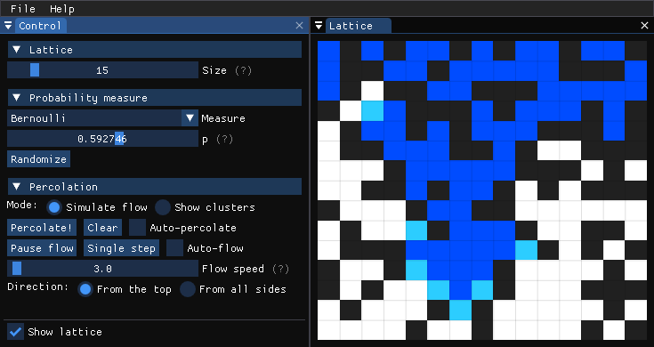
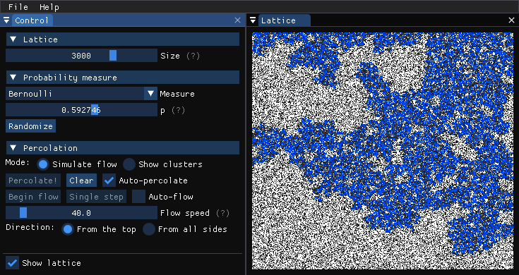

Percolator
==========

Percolator is a tool for running simulations of [percolation](https://en.wikipedia.org/wiki/Percolation_theory) on a planar lattice. Currently it only does site percolation on the square lattice.

Screenshots
-----------

Installing
----------

Percolator runs on Windows and Linux.

For Linux, see the building procedure below.

Windows binaries are [available here](https://yakov.shklarov.com/percolator/).

Building
--------

**Linux**: Install CMake, SDL2, and GLEW (if you're on debian: packages cmake, libsdl2-dev, and
libglew-dev). Then use the standard CMake build procedure. For example:

    $ git clone git@github.com:yshklarov/percolator.git
    $ mkdir percolator/build
    $ cd percolator/build
    $ cmake ..
    $ cmake --build . -v -j8
    $ ./percolator

**Windows**: Load the folder as a CMake project in you favorite IDE. All external includes and
libraries are already in the source tree. The build has been tested with MSVC on Visual Studio.

**Other platforms**: Percolator uses [ImGui](https://github.com/ocornut/imgui) for the user
interface. ImGui supports many different platforms and graphics backends, so it should be
relatively straightforward to get Percolator to build on your system.
